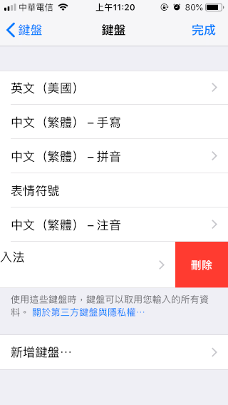

# 手機、平板也可以用的客家話拼音輸入法—利用RIME 框架系統

Last Tuesday 

- 特色：
    - 手機、平板也可以用的客家話輸入法。
    - 用國語注音、國語拼音輸入客家話文字，我們的大腦必須從客家話發音 → 漢字 → 國語發音 → 注音、拼音符號輸入 → 選字等這幾個步驟拆解。而客家話拼音輸入法，則可以縮短成客家話發音 → 拼音符號輸入 → 選字等步驟，幾乎省 50% 的腦力。
    - 通用拼音、教育部拼音的使用者都有適用的方案。
    - 拼音碼表根據徐兆泉老師編纂的《臺灣四縣腔海陸腔客家話辭典》, 2009, ISBN 9879576387159。由編者徐兆泉老師提供的同音字檢索資料製作。本輸入法以 Creative Commons (CC) 姓名標示、非商業性、相同方式分享。
    - 徐老師的字典採用的是通用拼音系統，而這個輸入法提供的教育部拼音，是透過 rime 系統轉換通用拼音成教育部拼音來比對。
    - 可以省略調號。省略調號則四縣、海陸似乎就沒有區別，但是有些字在不同的腔調有不同的發音 (例如「雞」，四縣是 gié，海陸是 gài )。另外，沒有調號，同音字就是所有音調的字的聯集，字數不少。所以，加上調號可以縮小同音字的字數，減少在長串候選字找字的麻煩。
    - 可以自動累積使用者鍵入過的語詞，做為下次優先推薦的候選字詞。
    - 目前還沒有內建客家話常用語詞。(僅兩、三個語詞確認可行性，待後續時程再加入)
    - 有幾個屬於罕用字體檔的客家話常用字，以變通的辦法方便在電腦、手機上表達，以利意見交流。例如，(亻厓)、(亻恩)、(火旁)、(扌帣)。當然，如果大家的電腦都有安裝「[花園明朝](http://fonts.jp/hanazono/)」字型檔的話，這種變通辦法就可以減少使用。手機無法安裝字形檔的就暫時要仰賴這種變通辦法了。
    - 如果是曾經鍵入的語詞，則可以使用各字的頭一個拼音字母做為縮寫帶出。例如，tgh 帶出「大家好」
    - 輸入的拼音會做正規的格式處理，可以不選漢字直接送出，適合做為拼音教材使用。例如，「大家好」四縣腔通用拼音 tai  gá hò, 教育部拼音 tai gaˊ hoˋ, 海陸腔通用拼音 tāi gà hó, 教育部拼音 tai⁺ gaˋ hoˊ 可以這樣直接送出。
    - 有四縣腔、海陸腔、以及四海腔、海四腔。
    - 跨平台：鼠鬚管 (macOS)、小狼毫 (Windows)、中州韻 (linux)、iRime (iOS, iPadOS)、同文 TRIME (android)。
- 下載合適腔調 (A )、拼音系統 (B)、平台 (C) 的輸入法規畫檔、字典檔、設定檔。
    - A 可以是 sy (四縣)、hl (海陸)、syh (四海)、hls (海四)
    - B 可以是 t (通用拼音)、g (教育部拼音)
    - C 可以是略過 (macOS, Windows, linux 電腦) 或是 m (iOS, iPadOS, android 等行動裝置)

    上述的輸入法規畫檔 (schema)、字典檔 (dict) 的檔名則是 k_A_B_C.schema.yaml 以及 k_A.dict.yaml

    設定檔 (只有行動版有額外的設定檔) 檔名則是 iRime.custom.yaml (iOS, iPadOS), trime.custom.yaml (android)

    例如，想要海陸腔、教育部拼音、安卓手機上使用，則要選擇下載 k_hl_g_m.schema.yaml、 k_hl.dict.yaml 這兩個檔案，以及 trime.custom.yaml 設定檔。

    Git Hub 下載點……。

    不管是否是要在行動裝置上安裝，還是在桌機、筆電上安裝，這些規畫檔、字典檔都要先透過電腦、筆電下載。暫時先存放在一個專屬的資料夾裏，資料夾名稱簡單英文就好。例如，在「下載」(download) 資料夾裏新增一個子資料夾，名叫「ktmp」。

- 下載合適平台版本的 rime 程式。
    - 鼠鬚管 (macOS)、小狼毫 (Windows)、中州韻 (linux)

        [https://rime.im/](https://rime.im/)

    - iRime (iOS, iPadOS)

        [https://apps.apple.com/tw/app/irime输入法-小鹤双拼五笔输入法/id1142623977](https://apps.apple.com/tw/app/irime%E8%BE%93%E5%85%A5%E6%B3%95-%E5%B0%8F%E9%B9%A4%E5%8F%8C%E6%8B%BC%E4%BA%94%E7%AC%94%E8%BE%93%E5%85%A5%E6%B3%95/id1142623977)

        雖然夾帶了「小鹤双五笔输入法」，不要緊，我們要的是 iRime 這個 app，也不會用到那個輸入法。

    - 同文 TRIME (android)

        [https://play.google.com/store/apps/details?id=com.osfans.trime&hl=zh_TW](https://play.google.com/store/apps/details?id=com.osfans.trime&hl=zh_TW)

    以上各版本的 rime 都是免費。是開源碼社群開發，主力開發者是中國社群。源碼都公開於 Git Hub，所以不用疑慮有暗藏病毒、木馬。

- 安裝 rime。
    - 鼠鬚管 (macOS)
        1. (可以參考這篇對於[鼠鬚管安裝](https://briian.com/50478/)的描述)(雖然這篇是針對鼠鬚管特化版 (注音版) 的描述，不過安裝的過程一樣，所以可以參考。)
        2. 安裝完之後，要加裝客家話輸入法規畫檔、字典檔，以及修改 default.custom.yaml。請參考本文下一節。
    - 小狼毫 (Windows)
        1. (可以參考這篇對於[小狼毫安裝](https://briian.com/9216/)的描述) 
        2. 在安裝時可以決定要安裝哪些輸入法。如果沒有特別需求，則只要選核心的「朙月拼音」即可。
        3. 安裝完之後，要加裝客家話輸入法規畫檔、字典檔，以及修改 default.custom.yaml。請參考本文下一節。
    - 中州韻 (linux)
        1. (可以參考這篇[在 linux 安裝 rime](https://amoshyc.github.io/blog/2018/install-liu-with-rime.html) 的描述)
        2. 安裝完之後，要加裝客家話輸入法規畫檔、字典檔，以及修改 default.custom.yaml。請參考本文下一節。
    - iRime (iOS, iPadOS)
        1. 在前一節描述的 App Store 找到 iRime 下載安裝。
        2. 打開 iOS, iPadOS 系統的「設定」(Settings)
        3. 點擊「一般」(General)／「鍵盤」(Keyboards)／「鍵盤」(Keyboards)
        4. 點擊「新增鍵盤…」

            

        5. 從新鍵盤的清單中，點選 「iRime」(應該在清單的最下方，因為是被歸類成第三方 third party 製作的)

            

        6. 在鍵盤清單中，點擊 iRime，以便做設定。

            

        7. 滑動開關，允許 iRime 有權限寫入檔案 (開關呈現綠色)。雖然警告文字很嚇人，但是要輸入法能夠紀錄你打過的字詞並建立使用者詞典，的確需要開放這個權限。我個人的看法是，這些程式是由開放源碼的社群開發出來的，程式碼裏面如果有暗中把紀錄傳到外人主機去的行為與規畫，應該早就被人挖出來撻伐了。目前還沒有聽過這樣的事件。再來，要用密碼登入任何賬號 (臉書、銀行……) 時，iOS / iPadOS 會強制切換到內建的英文鍵盤，不會是由第三方製作的鍵盤操作，所以這方面的資料是沒有機會由 iRime 紀錄的。如果要保守一點，就犧牲紀錄字詞的功能，可以不開放這個權限。

            

        8. 系統設定至此告一段落。可以按 Home 鍵回到手機桌面主畫面。打開任何一個可以打字、取消的 App 來試用 iRime。臉書 FB 是一個不錯的選項。打開臉書 FB，點選貼新文字的區域，鍵盤就出現了。

            

        9. 點選長壓左下角有地球圖案的按鈕，那是切換鍵盤用的 (如果只是點一下，沒有長壓，則是與你前一次切換前的鍵盤交換，適合快速換回原先使用的鍵盤。) 在出現的清單裏，可以點選 iRime 來試用。不過，這個階段的試用，還碰不到客家話輸入法。要進行到下一節，將輸入法規畫檔、字典檔、(以及行動版特有的設定檔) 加入 rime 框架之後，客家話輸入法才會生效。試打字之後記得在這個「建立貼文」左方的「取消」按一下。

            

        10. (日後如果要移除這個鍵盤) 如果使用之後不想再用它，有兩個方法。
            - 第一個是暫時的：回到 iOS, iPadOS 系統的「設定」(Settings)／一般 (General)／鍵盤 (Keyboards)／鍵盤 (Keyboards)，取得目前可以使用的鍵盤清單。將 iRime 那一筆用手指往左壓滑，會在右方出現紅色的刪除按鈕。點選按鈕即可。如果想要再加入，就再重複前面步驟「新增鍵盤」即可。
            - 第二個方法是永久的。就如同移除其他 app 的方式相同，在 iRime 存在的桌面畫面，長按 iRime App 圖像，直到每個 App 的圖像都在「發抖」，這時點擊 iRime App 圖像右上角的叉叉即可。如果想要再加入，則要重新下載。

            

        11. 安裝完之後，要加裝客家話輸入法規畫檔、字典檔，以及修改 default.custom.yaml。請參考本文下一節。
    - 同文 TRIME (android)
        1. 在前一節描述的 Google Play Store 找到同文 Trime 下載安裝。
        2. 在 android 系統設定裏，選擇「語言」(Language) ／「語言與輸入」(Language & Input)／「鍵盤與輸入法」(Keyboard & Input methods)／「目前鍵盤」(Current Keyboard)，在清單裏選擇 Trime。
        3. 安裝完之後，要加裝客家話輸入法規畫檔、字典檔，以及修改 default.custom.yaml。請參考本文下一節。
- 將輸入法規劃檔、字典檔、(以及行動版特有的設定檔) 加入 rime 框架。
    - macOS
        1. 在下載點另外下載 macOS 版的  add_schema.app 小程式。存放於先前建立的專屬資料夾，例如，「ktmp」。這個資料夾目前有我們準備安裝的輸入法規畫檔 (k_A_B.schema.yaml) 、字典檔 (k_A.dict.yaml )、以及 add_schema.app 程式。
        2. 在顯示幕上緣的選單條 (menu bar) 右方有輸入法選單，選了「Squirrel」(鼠鬚管) 後 (或用  command-space 切換輸入法後)，再從這選單選取「Settings……」(用戶設定)，會跳到 Finder 把 Rime 資料夾打開顯示。
        3. 如果 Rime 資料夾內已經有 default.custom.yaml 這個檔，請把它複製到前面步驟建立的臨時專屬資料夾，例如，「ktmp」。這個資料夾目前有我們準備安裝的輸入法規畫檔 (k_A_B.schema.yaml) 、字典檔 (k_A.dict.yaml )、default.custom.yaml、以及 add_schema.app 程式。如果 Rime 資料夾內沒有 default.custom.yaml 這個檔，沒有關係，下一步就會製作出來。
        4. 點擊 add_schema.app 程式兩下來執行它。它會依據目前所處的資料夾裏的規畫檔 ( schema 檔)，修改或建立一個 default.custom.yaml 檔。如果原先已經存在一個 (從 Rime 資料夾複製出來的)，則會把它改名 (加上日期時間戳記) 另存備份。add_schema.app 程式執行時不會顯示任何資訊，看起來好像沒有做什麼事。唯一有做事的線索是產生一個新的 default.custom.yaml (如果原先沒有)，或多了一個有時間戳記檔名的 default.custom.yaml 備份檔。
        5. 將臨時資料夾 ktmp 裏的輸入法規畫檔 (k_A_B.schema.yaml)、字典檔 (k_A.dict.yaml )、default.custom.yaml 複製到 Rime 資料夾裏。如果原先已經有 default.custom.yaml 檔，則用我們修改過的 (用 add_schema.app 程式產生的) 取代原先在 Rime 資料夾裏的。 
        6. 對 rime 系統做了任何修改，則一定要執行「Deploy」(佈署) 的選單指令，才會生效。
        7. 現在應該可以開始使用客家話輸入法了。
        8. 沒有限制只能使用一種客家話輸入法。如果你有興趣，可以全部都裝。
        9. 【註】default.custom.yaml 這個檔，也可以使用文字編輯器 (可以下載免費版的 [Text Wrangle](https://www.barebones.com/products/bbedit/download.html)r 或 [SubEthaEdit](https://apps.apple.com/tw/app/subethaedit/id728530824?l=en&mt=12)  來使用)  建立、編輯這個檔案，檔名是 default.custom.yaml，內容是 (為了方便舉例，假設我們選擇下載了四縣腔、教育部拼音，電腦平台，所以 A = sy, B = g, 沒有 C) 

                patch:
                  schema_list:
                    - schema: luna_pinyin   # 朙月拼音
                    - schema: k_sy_g        # 客家話 四縣 教育部拼音

            patch: 是第一層的標記，代表補丁的意思，用來修改系統本來的 default.yaml 檔。我們建立的這個檔，它包含了一個次層的標記，「schema_list:」。schema_list 標記下的列表，則是第三層。每一層的標記，都要比父母層的退縮 (往右) 兩個空格。schema 列表 (第三層) 的兩個條文，屬於同一層 (兄弟姐妹)，起頭要彼此對齊，都是前面有四格空格。這列表註記了要使用的 schema 檔名 (但不需要包含 .schema.yaml 副檔名)。除了我們要用的 k_sy_g 之外，記得也要包含預設的朙月拼音 luna_pinyin。共有兩個輸入法規畫檔。寫好則存檔、關閉。

        10. 【註】如果 Rime 資料夾裏已經有 default.custom.yaml 這個檔，代表你先前已經添加了一些輸入法。例如，「倉頡五代」的 cangjie5。而一些 Rime 內建的輸入法則列在 default.yaml 裏面。我們自建 default.custom.yaml 時，如果用的是 add_schema.app 程式，則它不會包括這些 Rime 內建的輸入法 (除了預設的「朙月拼音」之外)。所以，如果需要使用其他的 Rime 內建的輸入法，必須先自己編輯、建立一個 default.custom.yaml 檔，包含那些輸入法的清單，後續下載的輸入法，則可以用 add_schema.app 程式添加，不會覆蓋住先前加入的輸入法。
    - Windows
        1. 在下載點另外下載 Windows 版的  add_schema.exe 小程式。存放於先前建立的專屬資料夾，例如，「ktmp」。這個資料夾目前有我們準備安裝的輸入法規畫檔 (k_A_B.schema.yaml) 、字典檔 (k_A.dict.yaml )、以及 add_schema.exe 程式。
        2. 在「開始」選單按「【小狼毫】用戶文件夾」或開啟「C:\Users\你的名字\AppData\Roaming\Rime」這個資料夾。
        3. 如果 Rime 資料夾內已經有 default.custom.yaml 這個檔，請把它複製到前面步驟建立的臨時專屬資料夾，例如，「ktmp」。這個資料夾目前有我們準備安裝的輸入法規畫檔 (k_A_B.schema.yaml) 、字典檔 (k_A.dict.yaml )、default.custom.yaml、以及 add_schema.exe 程式。如果 Rime 資料夾內沒有 default.custom.yaml 這個檔，沒有關係，下一步就會製作出來。
        4. 點擊 add_schema.exe 程式兩下來執行它。它會依據目前所處的資料夾裏的規畫檔 ( schema 檔)，修改或建立一個 default.custom.yaml 檔。如果原先已經存在一個 (從 Rime 資料夾複製出來的)，則會把它改名 (加上日期時間戳記) 另存備份。add_schema.exe 程式執行時不會顯示任何資訊，看起來好像沒有做什麼事。唯一有做事的線索是產生一個新的 default.custom.yaml (如果原先沒有)，或多了一個有時間戳記檔名的 default.custom.yaml 備份檔。
        5. 將臨時資料夾 ktmp 裏的輸入法規畫檔 (k_A_B.schema.yaml)、字典檔 (k_A.dict.yaml )、default.custom.yaml 複製到 Rime 資料夾裏。如果原先已經有 default.custom.yaml 檔，則用我們修改過的 (用 add_schema.exe 程式產生的) 取代原先在 Rime 資料夾裏的。
        6. 對 rime 系統做了任何修改，則一定要執行「Deploy」(佈署) 的選單指令，才會生效。在「開始」選單按「【小狼毫】重新部署」。
        7. 現在應該可以開始使用客家話輸入法了。
        8. 沒有限制只能使用一種客家話輸入法。如果你有興趣，可以全部都裝。
        9. 【註】default.custom.yaml 這個檔，也可以用文字編輯器 (可以下載免費版的 [Notepad++](https://notepad-plus-plus.org/) 來使用)  建立、編輯這個檔案 (utf-8編碼，無 BOM 格式。以上這些設定，可以在 Notepad++ 的偏好設定裏指定做為文件的預設格式)，檔名是 default.custom.yaml，內容是 (為了方便舉例，假設我們選擇下載了四縣腔、教育部拼音，電腦平台，所以 A = sy, B = g, 沒有 C) 

                patch:
                  schema_list:
                    - schema: luna_pinyin   # 朙月拼音
                    - schema: k_sy_g        # 客家話 四縣 教育部拼音

            patch: 是第一層的標記，代表補丁的意思，用來修改系統本來的 default.yaml 檔。我們建立的這個檔，它包含了一個次層的標記，schema_list:。schema_list 標記下的列表，則是第三層。每一層的標記，都要比父母層的退縮 (往右) 兩個空格。schema 列表 (第三層) 的兩個條文，屬於同一層 (兄弟姐妹)，起頭要彼此對齊，都是前面有四格空格。這列表註記了要使用的 schema 檔名 (但不需要包含 .schema.yaml 副檔名)。除了我們要用的 k_sy_g 之外，記得也要包含預設的朙月拼音 luna_pinyin。共有兩個輸入法規畫檔。寫好則存檔、關閉。

        10. 【註】如果 Rime 資料夾裏已經有 default.custom.yaml 這個檔，代表你先前已經添加了一些輸入法。例如，「倉頡五代」的 cangjie5。而一些 Rime 內建的輸入法則列在 default.yaml 裏面。我們自建 default.custom.yaml 時，如果用的是 add_schema.exe 程式，則它不會包括這些 Rime 內建的輸入法 (除了預設的「朙月拼音」之外)。所以，如果需要使用其他的 Rime 內建的輸入法，必須先自己編輯、建立一個 default.custom.yaml 檔，包含那些輸入法的清單，後續下載的輸入法，則可以用 add_schema.exe 程式添加，不會覆蓋住先前加入的輸入法。
    - iRime (iOS, iPadOS)
        1. 需要使用電腦 (桌機、筆電) 來輔助安裝檔案。根據你的電腦的平台屬性，在下載點另外下載 macOS 版的  add_schema.app 小程式或 Windows 版的 add_schema.exe 小程式。存放於先前建立的專屬資料夾，例如，「ktmp」。這個資料夾目前有我們準備安裝的輸入法規畫檔 (k_A_B.schema.yaml) 、字典檔 (k_A.dict.yaml )、以及 add_schema 程式。
        2. 在 iRime app 裏，選擇執行「pc pass iRime」這個功能。

            

        3. 在「pc pass iRime」運作頁面，會顯示一個內網的網址 (例如下圖的 http://192.168.0.197)。這可以讓電腦 (pc/mac/linux) 用網頁瀏覽器連上 iphone / ipad 行動裝置，上傳、下載、刪除 rime 資料夾裏的檔案。我們的 iphone / ipad 用 WIFI 連上家裏的基地台路由器，與家裏要連線的電腦屬於同一個區域網路 (LAN)，才能連線成功。離開「pc pass iRime」運作頁面後，這個連線網址就無作用了。如果 iphone / ipad 畫面顯示無法產生網址，有問題時 (通常是休眠過後)，要把 iRime app 移除執行 (快速連按兩下 Home 鍵，再把 iRime app 的視窗往上滑開)。這是目前 iRime (版本 3.3.4) 的一個臭蟲。

            

        4. 在電腦用網頁瀏覽器 (例如 chrome) 連上這個網址，顯示的畫面如下。這個就是手機裏面的 Rime 資料夾。

            

        5. 如果 Rime 資料夾內已經有 default.custom.yaml 這個檔，請把它點擊下載到電腦裏。複製、或搬家到前面步驟建立的臨時專屬資料夾，例如，「ktmp」。這個資料夾目前有我們準備安裝的輸入法規畫檔 (k_A_B.schema.yaml) 、字典檔 (k_A.dict.yaml )、default.custom.yaml、以及 add_schema  程式。如果 Rime 資料夾內沒有 default.custom.yaml 這個檔，沒有關係，下一步就會製作出來。
        6. 點擊 add_schema 程式兩下來執行它。它會依據目前所處的資料夾裏的規畫檔 ( schema 檔)，修改或建立一個 default.custom.yaml 檔。如果原先已經存在一個 (從 Rime 資料夾複製出來的)，則會把它改名 (加上日期時間戳記) 另存備份。add_schema 程式執行時不會顯示任何資訊，看起來好像沒有做什麼事。唯一有做事的線索是產生一個新的 default.custom.yaml (如果原先沒有)，或多了一個有時間戳記檔名的 default.custom.yaml 備份檔。
        7. 將臨時資料夾 ktmp 裏的輸入法規畫檔 (k_A_B.schema.yaml)、字典檔 (k_A.dict.yaml )、default.custom.yaml 上傳到 Rime 資料夾裏。如果 iphone / ipad 裏已經有同名的檔案 (也許是因為要做更新？)，請先刪除再上傳。 (用列表條文右方的垃圾桶圖像按鈕執行)。依據 iRime 官網的描述，在 iOS, iPadOS 裏，檔案不會被覆蓋，會造成多個同性質的檔案，容易引起錯誤。所以，已存在的同名檔案要先刪除後再上傳。
        8. 先前輸入法下載點下載的 iRime.custom.yaml，把它上傳到 iphone / ipad 裏。如果 iphone / ipad 裏已經有同名的檔案 (也許是因為要做更新？)，請先刪除再上傳。
        9. 對 rime 系統做了任何修改，則一定要執行「Deploy」(佈署) 的指令，才會生效。在 iRime app 裏，選擇執行「Deploy」(佈署) 這個功能。不過，佈署過程應該顯示的「佈署中……」、「佈署成功」的文字框，不一定每次都看得到文字，這是目前 iRime 的一個臭蟲。
        10. 現在應該可以開始使用客家話輸入法了。
        11. 沒有限制只能使用一種客家話輸入法。如果你有興趣，可以全部都裝。
        12. 【註】default.custom.yaml 這個檔，也可以使用文字編輯器 (可以下載免費版的 [Notepad++](https://notepad-plus-plus.org/)、[Text Wrangle](https://www.barebones.com/products/bbedit/download.html)r 或 [SubEthaEdit](https://apps.apple.com/tw/app/subethaedit/id728530824?l=en&mt=12)  來使用)  建立、編輯這個檔案，檔名是 default.custom.yaml，內容是 (為了方便舉例，假設我們選擇下載了四縣腔、教育部拼音，電腦平台，所以 A = sy, B = g, 沒有 C) 

                patch:
                  schema_list:
                    - schema: luna_pinyin   # 朙月拼音
                    - schema: k_sy_g        # 客家話 四縣 教育部拼音

            patch: 是第一層的標記，代表補丁的意思，用來修改系統本來的 default.yaml 檔。我們建立的這個檔，它包含了一個次層的標記，schema_list:。schema_list 標記下的列表，則是第三層。每一層的標記，都要比父母層的退縮 (往右) 兩個空格。schema 列表 (第三層) 的兩個條文，屬於同一層 (兄弟姐妹)，起頭要彼此對齊，都是前面有四格空格。這列表註記了要使用的 schema 檔名 (但不需要包含 .schema.yaml 副檔名)。除了我們要用的 k_sy_g 之外，記得也要包含預設的朙月拼音 luna_pinyin。共有兩個輸入法規劃檔。寫好則存檔、關閉。

        13. 【註】如果 Rime 資料夾裏已經有 default.custom.yaml 這個檔，代表你先前已經添加了一些輸入法。例如，「倉頡五代」的 cangjie5。而一些 Rime 內建的輸入法則列在 default.yaml 裏面。我們自建 default.custom.yaml 時，如果用的是 add_schema 程式，則它不會包括這些 Rime 內建的輸入法 (除了預設的「朙月拼音」之外)。所以，如果需要使用其他的 Rime 內建的輸入法，必須先自己編輯、建立一個 default.custom.yaml 檔，包含那些輸入法的清單，後續下載的輸入法，則可以用 add_schema 程式添加，不會覆蓋住先前加入的輸入法。
    - TRIME (android)
        1. 需要使用電腦 (桌機、筆電) 來輔助安裝檔案。根據你的電腦的平台屬性，在下載點另外下載 macOS 版的  add_schema.app 小程式或 Windows 版的 add_schema.exe 小程式。存放於先前建立的專屬資料夾，例如，「ktmp」。這個資料夾目前有我們準備安裝的輸入法規畫檔 (k_A_B.schema.yaml) 、字典檔 (k_A.dict.yaml )、以及 add_schema 程式。 
        2. 在你的行動裝置執行 Google Play Store 下載 [Cx File Explorer](https://play.google.com/store/apps/details?id=com.cxinventor.file.explorer&hl=zh_TW) 這個 app，做為你的行動裝置與電腦連線的橋樑。安裝好之後執行，主畫面選擇 Network (網路)：Access from PC。兩樣都勾選：Random port number (每次連線時使用隨意選取的埠號) 與 Show hidden files (隱藏檔也要看)。然後選擇「Start Service」(開始服務)。出現的內網網址，這可以讓電腦 (pc/mac/linux) 用網頁瀏覽器連上 android 行動裝置。由於使用的是 FTP 網路傳檔協定，下載 (點擊檔案)、上傳 (把電腦的檔案圖像拖曳至瀏覽器視窗內) 雖然可以做到，但是刪除檔案則似乎不太明顯要怎麼做。建議在電腦端另外下載專門的 FTP 用戶端程式 [CyberDuck](https://cyberduck.io/download/)，然後把 Cx File Explorer 列出的 ftp://內網網址給 CyberDuck 處理 (網址末端、在冒號之後的四位數是隨機產生的埠號，也要在 CyberDuck 合適的欄位填寫)。我們的 android 行動裝置 用 WIFI 連上家裏的基地台，與家裏要連線的電腦屬於同一個區域網路 (LAN)，才能連線成功。連線後瀏覽找尋資料夾 Rime。以下步驟把檔案傳輸完成後，就可以在 android 行動裝置上把 Cx File Explorer  畫面點選「Stop Service」(停止服務)。 
        3. 如果 Rime 資料夾內已經有 default.custom.yaml 這個檔，請把它點擊下載到電腦裏。複製、或搬家到前面步驟建立的臨時專屬資料夾，例如，「ktmp」。這個資料夾目前有我們準備安裝的輸入法規畫檔 (k_A_B.schema.yaml) 、字典檔 (k_A.dict.yaml )、default.custom.yaml、以及 add_schema  程式。如果 Rime 資料夾內沒有 default.custom.yaml 這個檔，沒有關係，下一步就會製作出來。
        4. 點擊 add_schema 程式兩下來執行它。它會依據目前所處的資料夾裏的規畫檔 ( schema 檔)，修改或建立一個 default.custom.yaml 檔。如果原先已經存在一個 (從 Rime 資料夾複製出來的)，則會把它改名 (加上日期時間戳記) 另存備份。add_schema 程式執行時不會顯示任何資訊，看起來好像沒有做什麼事。唯一有做事的線索是產生一個新的 default.custom.yaml (如果原先沒有)，或多了一個有時間戳記檔名的 default.custom.yaml 備份檔。
        5. 將臨時資料夾 ktmp 裏的輸入法規畫檔 (k_A_B.schema.yaml)、字典檔 (k_A.dict.yaml )、default.custom.yaml 上傳到 Rime 資料夾裏。如果 android 行動裝置裏已經有同名的檔案 (也許是因為要做更新？)，請先刪除再上傳。
        6. 先前輸入法下載點下載的 trime.custom.yaml，把它上傳到 android 行動裝置裏。如果 裝置裏已經有同名的檔案 (也許是因為要做更新？)，請先刪除再上傳。
        7. 可以在 android 行動裝置上把 Cx File Explorer  畫面點選「Stop Service」(停止服務)。 切換到 TRIME app
        8. 對 rime 系統做了任何修改，則一定要執行「Deploy」(佈署) 的指令，才會生效。在 TRIME app 裏，選擇執行「Deploy」(佈署) 這個功能。
        9. 現在應該可以開始使用客家話輸入法了。
        10. 沒有限制只能使用一種客家話輸入法。如果你有興趣，可以全部都裝。
        11. 【註】default.custom.yaml 這個檔，也可以使用文字編輯器 (可以下載免費版的 [Notepad++](https://notepad-plus-plus.org/)、[Text Wrangle](https://www.barebones.com/products/bbedit/download.html)r 或 [SubEthaEdit](https://apps.apple.com/tw/app/subethaedit/id728530824?l=en&mt=12)  來使用)  建立、編輯這個檔案，檔名是 default.custom.yaml，內容是 (為了方便舉例，假設我們選擇下載了四縣腔、教育部拼音，電腦平台，所以 A = sy, B = g, 沒有 C) 

                patch:
                  schema_list:
                    - schema: luna_pinyin   # 朙月拼音
                    - schema: k_sy_g        # 客家話 四縣 教育部拼音

            patch: 是第一層的標記，代表補丁的意思，用來修改系統本來的 default.yaml 檔。我們建立的這個檔，它包含了一個次層的標記，schema_list:。schema_list 標記下的列表，則是第三層。每一層的標記，都要比父母層的退縮 (往右) 兩個空格。schema 列表 (第三層) 的兩個條文，屬於同一層 (兄弟姐妹)，起頭要彼此對齊，都是前面有四格空格。這列表註記了要使用的 schema 檔名 (但不需要包含 .schema.yaml 副檔名)。除了我們要用的 k_sy_g 之外，記得也要包含預設的朙月拼音 luna_pinyin。共有兩個輸入法規劃檔。寫好則存檔、關閉。

        12. 【註】如果 Rime 資料夾裏已經有 default.custom.yaml 這個檔，代表你先前已經添加了一些輸入法。例如，「倉頡五代」的 cangjie5。而一些 Rime 內建的輸入法則列在 default.yaml 裏面。我們自建 default.custom.yaml 時，如果用的是 add_schema 程式，則它不會包括這些 Rime 內建的輸入法 (除了預設的「朙月拼音」之外)。所以，如果需要使用其他的 Rime 內建的輸入法，必須先自己編輯、建立一個 default.custom.yaml 檔，包含那些輸入法的清單，後續下載的輸入法，則可以用 add_schema 程式添加，不會覆蓋住先前加入的輸入法。
- 開始使用。
    - 電腦版
        1. 可以用 ctrl-` 鍵叫出 rime 設定選單。如果安裝有多個 rime 輸入法，可以在這裏選擇。目前在用的，是選項 1，前一次用的是選項 3，其他更多的輸入法在選項4 以即之後。選項 2 是輸出過濾器設定。選了 2 之後再選擇要做的是中文／英文切換、全形／半形切換、繁體／簡體切換。
        2. 調號是在一個字的拼音打完之後鍵入 (也可以不輸入)。調號符號請參考以下表格。選字時用大寫的 ABCD……(shift-a, shift-b, ……)。如果第一個字就是我們要的，可以再用空格選它。如果不選，繼續鍵入下一個字的拼音，則可以與過去輸入過的字詞比對，得到正確的組合。如果候選字太多，第一頁不夠用，可以用鍵盤的「下一頁 PgDn」鍵或「右箭頭」、「下箭頭」換頁。
        3. rime 輸入系統會順便給我們輸入的拼音做正規的格式處理。如果想要這個拼音，而不是要漢字 (例如，製作拼音教材)，可以在選字前使用 shift-enter 將此拼音送出。
        4. 在新的拼音開始時先按「`」鍵 (grave) (在鍵盤左上角、1 鍵的左邊，ESC 鍵的下方) ，可以叫出 rime 反查模式。設定是用國語的拼音 (不需鍵入調號)，然後會列出可能的漢字，以及所對應的客家話拼音。對於不知客家話如何發音的漢字，以國語的發音找出該字，順便學習它的客家話拼音寫法。
        5. 拼音寫到一半發現打錯字，或者拼音打完要選字時發現不對，可以用 esc 鍵取消，然後重打。
    - 行動版 (iOS, iPadOS)
        1. 調號是在一個字的拼音打完之後鍵入 (也可以不輸入)，請參考以下表格。這些調號符號與E, R, T, U, I, O, P字母鍵共用空間，要以「手指壓住往上滑出邊界」的方式取用。iOS 裝置 (iPhone) 會在這滑動的過程中呈現像漫畫裏的對話泡泡顯示這另一個符號；iPadOS 裝置目前 iRime 還無法如此呈現，但是仍然能夠以滑動取用。
        2. 當候選字出現時，可以直接用手指、筆去點選想要的字。如果不選，繼續鍵入下一個字的拼音，則可以與過去輸入過的字詞比對，得到正確的組合。如果候選字過多，可以用手指壓住候選字串條去捲頁。
        3. iRime 輸入系統會順便給我們輸入的拼音做正規的格式處理。如果想要這個拼音，而不是要漢字 (例如，製作拼音教材)，可以在選字前使用 右下角的 enter 送出拼音。
        4. 在新的拼音開始時先按「`」鍵 (grave) (與左上角的 Q 鍵同位置，以「手指壓住往上滑出邊界」的方式取用) ，可以叫出 rime 反查模式。設定是用國語的拼音 (不需鍵入調號)，然後會列出可能的漢字，以及所對應的客家話拼音。對於不知客家話如何發音的漢字，以國語的發音找出該字，順便學習它的客家話拼音寫法。
    - 行動版 (android)
        1. 調號是在一個字的拼音打完之後鍵入 (也可以不輸入)，請參考以下表格。這些調號符號與E, R, T, U, I, O, P字母鍵共用空間，要以「長壓」的方式取用。
        2. 當候選字出現時，可以直接用手指、筆去點選想要的字。如果不選，繼續鍵入下一個字的拼音，則可以與過去輸入過的字詞比對，得到正確的組合。如果候選字過多，可以用手指壓住候選字串條去卷頁。
        3. TRIME 輸入系統會順便給我們輸入的拼音做正規的格式處理。如果想要這個拼音，而不是要漢字 (例如，製作拼音教材)，可以在選字前使用 右下角的 enter 送出拼音。
        4. 在新的拼音開始時先按「`」鍵 (grave) (與左上角的 Q 鍵同位置，以「長壓」的方式取用) ，可以叫出 rime 反查模式。設定是用國語的拼音 (不需鍵入調號)，然後會列出可能的漢字，以及所對應的客家話拼音。對於不知客家話如何發音的漢字，以國語的發音找出該字，順便學習它的客家話拼音寫法。
        5. 拼音寫到一半發現打錯字，或者拼音打完要選字時發現不對，可以用 esc 鍵 (與右下角的退格 back space 鍵同位置。可以用壓住往左滑動的方式取得) 取消，然後重打。

[調號鍵](https://www.notion.so/f50c522cd9af42e5aa5b10d39c4dcbfa)

[音調說明](https://www.notion.so/c13e9d5de33742808e1dcd36e18e1476)

上面表格中，▪︎表示高入調的符號。電腦版是空白鍵，行動裝置版是「高」鍵。